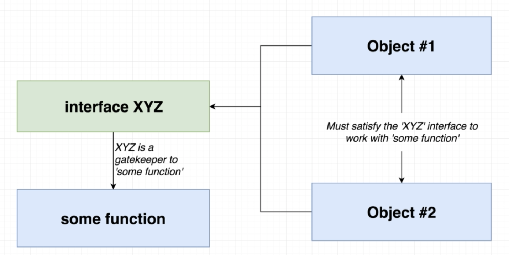

# 🥑 The All Important Interfaces

## Interfaces

Interfaces are **basically type annotations on steroids.** These will truly permit us to use TS at it's fullest. They are **what makes TS so powerful.**

With classes, interfaces will allow us to reuse code in ways never before.

Interfaces just **create a new type, describing the property names and value types of an object.**

---

## Long Type Annotations

The problem with type annotations of objects is that they are **really long**.

```ts
const markProperties = {
  name: 'Mark',
  lastName: 'Music',
  age: 15,
};

const printDetails = (mark: {
  name: string;
  lastName: string;
  age: number;
}) => {
  console.log(`Name : ${mark.name} ${mark.lastName}`);
  console.log(`Age : ${mark.age}`);
};
```

As you can see, the type annotations seem endless. This is even worse when you need to write this type annotation multiple times. However, here is where **interfaces** come in handy.

---

## Fixing Long Type Annotations

To fix this, we can simply use an **interface**.

```ts
interface Person {
  name: string;
  lastName: string;
  age: number;
}

const markProperties = {
  name: 'Mark',
  lastName: 'Music',
  age: 15,
};

const printDetails = (mark: Person) => {
  console.log(`Name : ${mark.name} ${mark.lastName}`);
  console.log(`Age : ${mark.age}`);
};
```

**CODE DECONSTRUCTION:** In this code snippet, we are simply replacing that long annotation with an interface called `Person`. _Notice how it's capitalized and generic._ To create an interface, follow these steps:

1.  `interface` tells TS that you are declaring an interface.
2.  `Person` is just the name of the type you're creating.
3.  `{}` is what the type consists of.
4.  `name: string` is simply telling TS that the `Person` type has a property called `name` and it's value is of type string.
5.  `lastName: string` and `age: number` are basically the same.

_Notice how the property names are the same, as much as their value types._

---

## Syntax Around Interfaces

We are **not limited to set primitive types** in an interface. You can set any type. **Even other types created by other interfaces.**

```ts
interface Person {
  name: string;
  lastName: string;
  age: Date;
  summary(): string;
}

const markProperties = {
  name: 'Mark',
  lastName: 'Music',
  age: new Date(),
  summary() {
    return `Name: ${this.name} ${this.lastName}
Age: ${this.age}`;
  },
};

const printDetails = (mark: Person) => {
  console.log(mark.summary());
};
```

**CODE DECONSTRUCTION:** In this code snippet, we are using more complex types in the interface.

1.  The `age` property has a type of `Date`
2.  The `summary` property has a type of `summary():string;`

Note how **we use the ES15 syntax** to **use functions in an object**. We can **do the same for interfaces.**

---

## More on Interfaces

If an **interface has a single type** and we are **assigning that interface to an object with multiple types**, interfaces **will work while one of the types that the object has satisfies the interface.**

```ts
interface Car {
  summary(): string;
}

const car = {
  name: 'La Ferrari',
  brand: 'Ferrari',
  age: new Date(),
  summary() {
    return `
    Name : ${this.name}
    Brand : ${this.brand}
    Age: ${this.age}
    `;
  },
};
```

**CODE DECONSTRUCTION:** As you can see in the code snippet, the interface `Car` has only one type. However, since the object `car` does have a method called `summary` and it does return a string, the code works perfectly.

---

## Code Reuse with Interfaces

One of the most important and powerful things about interfaces is **how they can be used by multiple objects.**

Take this example:

```ts
interface Equation {
  formula(): void;
}

const addNumbers = {
  num1: 1,
  num2: 10,
  formula() {
    return this.num1 - this.num2;
  },
};

const mean = {
  data: [1, 7, 3, 4, 5, 6, 2],
  formula() {
    const sortedData: number[] = this.data;
    let sum = 0;
    for (let i = 0; i < sortedData.length; i++) {
      sum += sortedData[i];
    }
    return sum / sortedData.length;
  },
};

const calculateEquation = (equation: Equation) => {
  return equation.formula();
};
```

**CODE DECONSTRUCTION:** In this code snippet, **we are simplifying the interface** `Equation` from an interface called `Add`. Since **`Equation` is compatible with any object that has a function called equation in it**, this **allows us to not have to write as much code.** Simpler functions also allow us to **reuse code by making it simpler.**

---

## General Plan with Interfaces



One of the most important things to understand with **interfaces is that they are best used as gatekeepers.** This is to follow the **Object Oriented Programming** methodology with **_reusable code_**.
